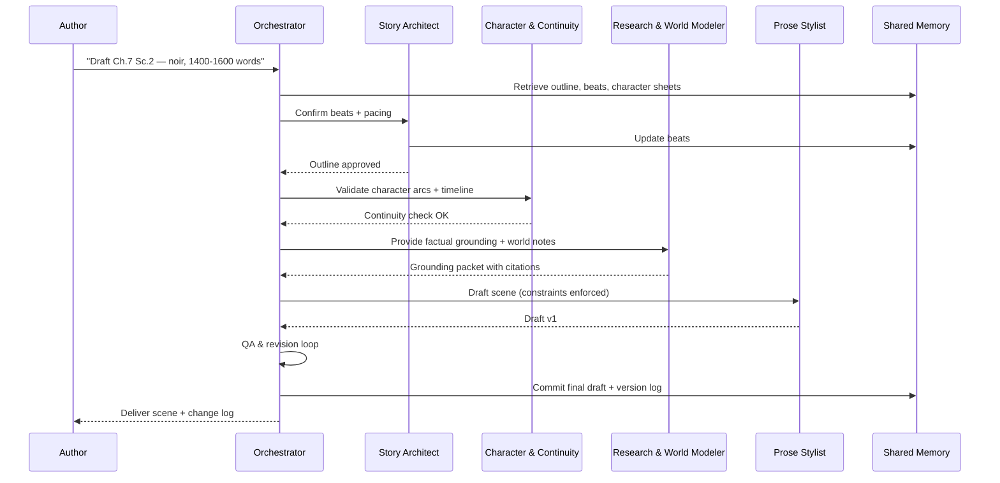

# Multi-Agent Swarm Specification for a Novel-Writing Super-Agent

## Overview
This document defines a working specification for a multi-agent "swarm" system designed to support long-form novel writing. The system is **platform-agnostic**, modular, and structured around one **Orchestrator Agent** and four **Focused AI Assistants**. Together they maintain coherence, consistency, and quality across the drafting process.

---

## The Five Agents

### 1. Orchestrator (Super-Agent)
**Role:** Supervises, plans, delegates, and synthesizes outputs.  
**Inputs:** User goals, style guides, canon (memory).  
**Outputs:** Task plans, merged drafts, revision briefs, canonical updates.  
**Responsibilities:**
- Plan & decompose user requests.
- Route tasks to specialists.
- Enforce constraints (POV, tense, genre, length).
- Merge and QA outputs.
- Govern shared memory and change logs.

---

### 2. Story Architect
**Role:** Designs macro-structure (acts, sequences, beats).  
**Inputs:** Genre brief, comps, outline.  
**Outputs:** Updated outline, beats, pacing notes.  
**Responsibilities:**
- Maintain beat sheets (3-act, 7-point, or custom).  
- Track pacing and thematic arcs.  
- Provide change rationales when adjusting story flow.

---

### 3. Character & Continuity Agent
**Role:** Ensures consistency of character arcs, voices, and timelines.  
**Inputs:** Character sheets, prior chapters, outline.  
**Outputs:** Updated character dossiers, continuity approvals/flags.  
**Responsibilities:**
- Maintain character bible and dialogue consistency.  
- Detect contradictions, anachronisms, or POV drift.  
- Approve/reject changes before canon update.

---

### 4. Research & World Modeler
**Role:** Provides grounding facts, citations, and manages world-building.  
**Inputs:** Research queries, world assumptions, user notes.  
**Outputs:** Grounding packets, citations, world-bible updates.  
**Responsibilities:**
- Verify facts and plausibility.  
- Update world bible with new rules, lore, or factual data.  
- Flag cultural, ethical, or legal risks.

---

### 5. Prose Stylist & Line Editor
**Role:** Drafts and polishes prose consistent with style guide.  
**Inputs:** Scene briefs, constraints, beats, citations.  
**Outputs:** Draft scenes, polished passages, alternative takes.  
**Responsibilities:**
- Translate beats into compelling text.  
- Enforce narrative voice and cadence.  
- Offer stylistic alternatives (A/B drafts).

---

## Shared Memory
The agents use a **central memory layer** accessible via read/write APIs.  
Components include:
- **World Bible** (entities, rules, locations).  
- **Outline & Beat Ledger** (hierarchical structure with statuses).  
- **Character Dossiers** (bios, arcs, voices).  
- **Timeline Graph** (events and dependencies).  
- **Sources Index** (citations, sensitivity notes).

Only the Orchestrator commits final canonical updates.

---

## Message Schema

### Task Schema
```json
{
  "goal": "Draft Scene",
  "constraints": {
    "word_count": "1400-1600",
    "tense": "present",
    "POV": "first-person",
    "style": "noir"
  },
  "inputs": ["Ch.7, Scene 2 beats", "Character arcs", "World bible refs"],
  "acceptance_tests": ["POV=first-person", "word_count <=1600", "continuity=pass"],
  "return_schema": "scene_draft"
}
```

### Result Schema
```json
{
  "status": "success",
  "artifact_uri": "memory://scenes/ch7_s2_v2",
  "citations": ["src:research/finance-fraud-note1"],
  "rationales": ["Continuity preserved, Caleb arc updated"],
  "version": "2.1"
}
```

---

## Orchestration Workflow (Example: Draft Chapter 7, Scene 2)
1. User request → Orchestrator parses intent.  
2. Orchestrator retrieves canon from memory.  
3. Story Architect confirms beats and pacing.  
4. Character & Continuity validates arcs/voices.  
5. Research provides grounding packet + citations.  
6. Prose Stylist drafts scene.  
7. Orchestrator merges, QA-checks, and requests revisions if needed.  
8. Orchestrator updates memory and delivers draft with change log.  

---

## Sequence Diagram


---

## Quality & Safety Controls
- **Continuity tests:** POV/tense, timeline, contradictions.  
- **Legal/ethics:** Flag defamation/privacy risks.  
- **Style checks:** Regex + embeddings for banned/required stylistic rules.  
- **Plagiarism scan:** Compare against prior memory & external corpora.  
- **Cultural review:** Optional sensitivity checks.  

---

## Recommendations
- Begin with a **three-agent minimum** (Orchestrator, Architect, Stylist).  
- Add Character & Research agents for canonical drafts.  
- Use caching to reduce cost.  
- Implement human-in-the-loop approvals for major canon updates.

---
